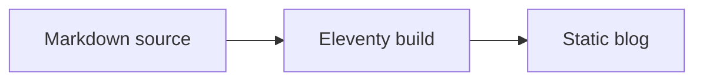
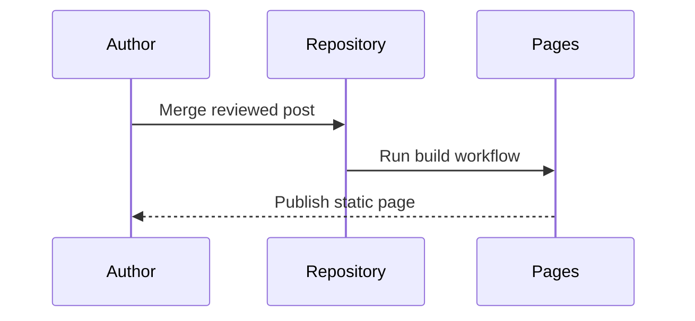
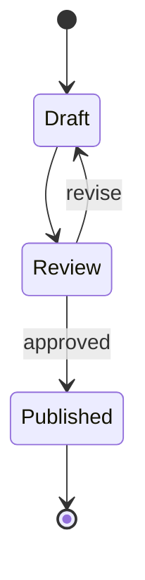
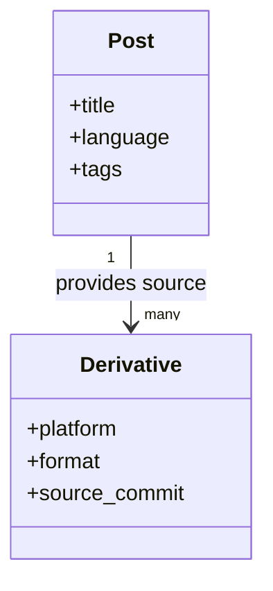
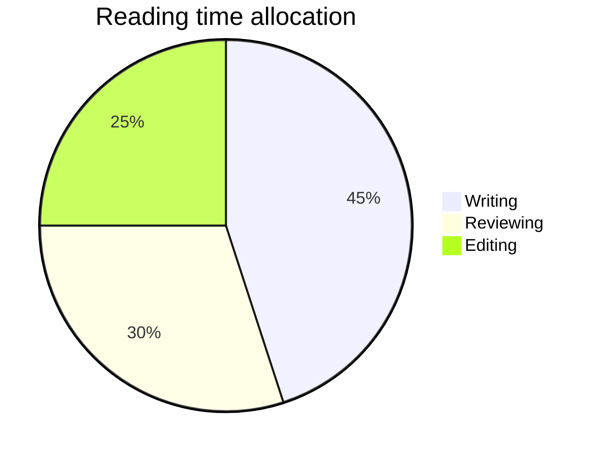
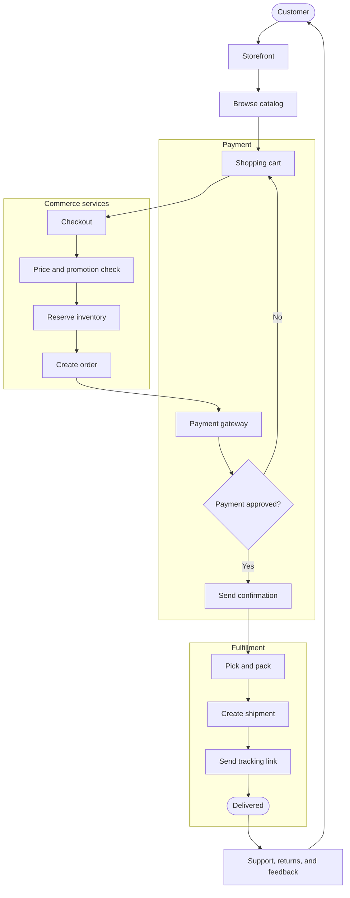

Diagrams and equations work best when they remain close to the sentence that needs them. They should clarify an idea, not become a separate document to maintain. This post is a compact catalogue of the formats available in the blog.

## 1. A publishing flow

## 2. An inline equation

A small expression such as $E = mc^2$ can stay inside the sentence it supports.

## 3. A display equation

$$
\sum_{i=1}^{n} i = \frac{n(n + 1)}{2}
$$

## 4. A request sequence

## 5. A quadratic relationship

The roots of $ax^2 + bx + c = 0$ are defined by:

$$
x = \frac{-b \pm \sqrt{b^2 - 4ac}}{2a}
$$

## 6. A state transition

## 7. A small matrix

$$
\begin{bmatrix}
1 & 0 \\
0 & 1
\end{bmatrix}
\begin{bmatrix}
x \\
y
\end{bmatrix}
=
\begin{bmatrix}
x \\
y
\end{bmatrix}
$$

## 8. A class relationship

## 9. An integral

For a continuously changing quantity, the accumulated value can be described as:

$$
\int_a^b f(x)\,dx
$$

## 10. A distribution

## 11. An e-commerce order flow

Keeping these elements in Markdown means the explanation, its source, and its visual form can evolve together.
