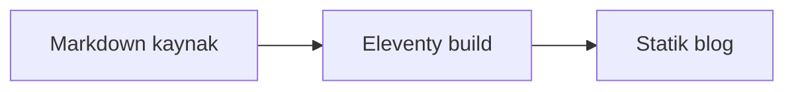
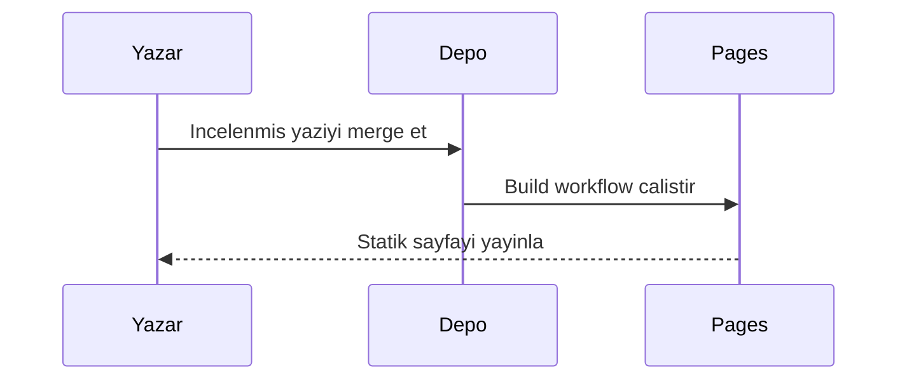
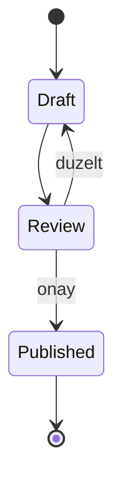
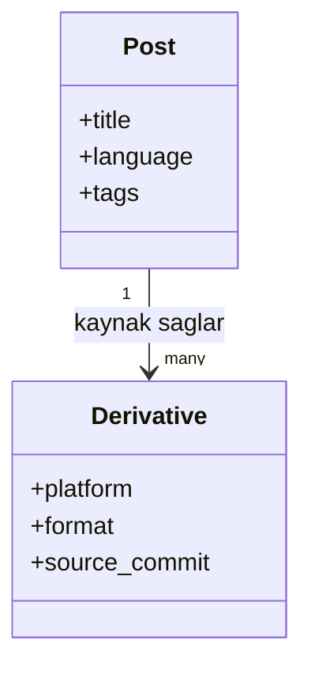
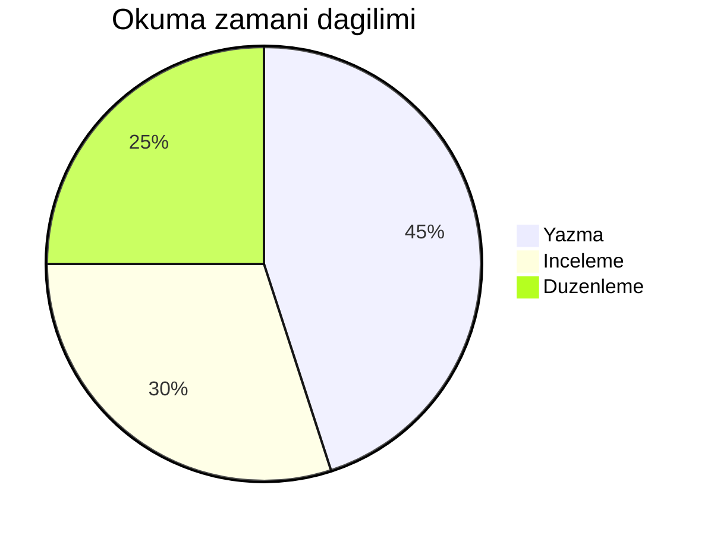
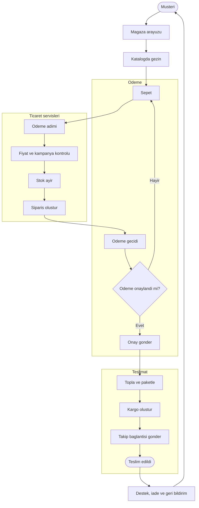

Diyagramlar ve denklemler, ihtiyac duyan cumleye yakin olduklarinda en iyi sonucu verir. Bir fikri aciklamali, bakimi gereken ayri bir belgeye donusmemelidirler. Bu yazi blogda kullanilabilecek bicimlerin kucuk bir katalogudur.

## 1. Bir yayin akisi

## 2. Satir ici denklem

$E = mc^2$ gibi kucuk bir ifade, destekledigi cumlenin icinde kalabilir.

## 3. Blok denklem

$$
\sum_{i=1}^{n} i = \frac{n(n + 1)}{2}
$$

## 4. Istek sirasi

## 5. Ikinci dereceden iliski

$ax^2 + bx + c = 0$ denkleminin kokleri soyle tanimlanir:

$$
x = \frac{-b \pm \sqrt{b^2 - 4ac}}{2a}
$$

## 6. Durum gecisi

## 7. Kucuk bir matris

$$
\begin{bmatrix}
1 & 0 \\
0 & 1
\end{bmatrix}
\begin{bmatrix}
x \\
y
\end{bmatrix}
=
\begin{bmatrix}
x \\
y
\end{bmatrix}
$$

## 8. Sinif iliskisi

## 9. Integral

Surekli degisen bir niceligin birikmis degeri soyle ifade edilebilir:

$$
\int_a^b f(x)\,dx
$$

## 10. Dagilim

## 11. E-commerce siparis akisi

Bu ogeleri Markdown icinde tutmak, aciklamanin, kaynaginin ve gorsel biciminin birlikte gelismesini saglar.
